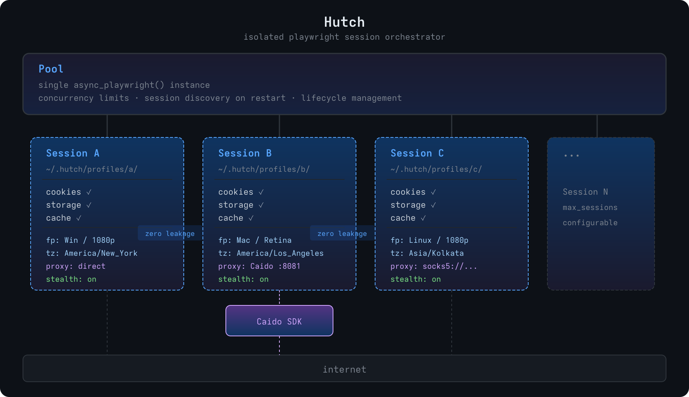

isolated playwright session orchestrator.

multiple browser sessions, persistent state, per-session proxy, coherent fingerprints, zero leakage.
daemon mode with JSON-RPC API for agent-driven automation.

### Architecture



### Install

```bash
git clone https://github.com/AbuCTF/Hutch.git
cd Hutch
./setup.sh
```

or manually:

```bash
pip install -e ".[dev]"
playwright install chromium
playwright install-deps chromium
```

### Quick start

#### CLI

```bash
hutch create target-a --preset win-desktop-1080p
hutch create target-a --proxy http://127.0.0.1:8081 --ignore-https-errors
hutch create yandex --program yandex --headed
hutch list
hutch auth target-a --url https://target.com/login
hutch screenshot target-a evidence.png --full-page
hutch close target-a
hutch destroy target-a
hutch presets

# start the daemon
hutch serve
hutch serve --idle-timeout 0
```

#### Python — direct

```python
from hutch import Pool, generate, generate_for_program

async with Pool() as pool:
    s = await pool.create(
        "target-a",
        fingerprint=generate(preset="win-desktop-1080p"),
        proxy="http://127.0.0.1:8081",
        ignore_https_errors=True,
    )

    # action methods with smart waits
    await s.goto("https://target.com")
    await s.fill("#username", "user@test.com")
    await s.fill("#password", "pass")
    await s.click("#login-btn")  # waits for networkidle

    # observe all interactive elements
    elements = await s.observe()
    for el in elements:
        print(f"[{el['idx']}] {el['tag']} — {el['text']} → {el['selector']}")

    # page state (url + title + a11y tree) after every action
    state = await s.page_state()

    # context capture — network, console, errors
    snap = await s.snapshot(screenshot=True, storage=True)
    diff = await s.diff()  # only what changed since last check

    # cookie manipulation
    cookies = await s.cookies()
    await s.set_cookie(name="session", value="abc", domain=".target.com", path="/")
    await s.delete_cookies()

    # localStorage / sessionStorage
    await s.set_storage("token", "eyJ...")
    store = await s.storage()

    # request interception
    async def swap_auth(route):
        headers = {**route.request.headers, "Authorization": "Bearer other-user"}
        await route.continue_(headers=headers)
    await s.intercept("**/api/*", swap_auth)

    await s.save_state()
    await s.close()

    # reopen later — full auth state restored
    s = await pool.get("target-a", launch=True)
```

#### Python — daemon client

```python
from hutch import connect

async with HutchClient() as client:
    s = await client.create("target-a", preset="win-desktop-1080p")

    await s.goto("https://target.com/login")
    await s.fill("#user", "admin")
    await s.fill("#pass", "test")
    state = await s.click("#submit")

    elements = await s.observe()
    snap = await s.snapshot(screenshot=True)
    network = await s.network(pattern="/api/")

    # request modification
    await s.modify_headers({"X-Forwarded-For": "127.0.0.1"}, pattern="**/api/*")
    await s.block_urls(["**/analytics*", "**/tracking*"])

    # human-in-the-loop handoff
    info = await s.handoff()
    if info["state"] == "paused":
        # solve captcha in headed browser...
        await s.resume()
```

#### Multi-session IDOR testing

```python
async with Pool() as pool:
    await pool.create("user-a", fingerprint=generate_for_program("target"))
    await pool.create("user-b", fingerprint=generate_for_program("target"))

    # login each session with different accounts...

    # parallel navigation — same endpoint, different auth
    results = await pool.parallel_goto(
        ["user-a", "user-b"],
        "https://target.com/api/profile/123"
    )

    # compare responses across sessions
    comparison = await pool.compare(
        ["user-a", "user-b"],
        "https://target.com/api/admin/users"
    )
```

### Features

| Feature | Description |
|---------|-------------|
| **Session isolation** | Separate profile dirs, cookies, storage, proxy per session |
| **Coherent fingerprints** | UA matches platform matches screen matches timezone |
| **Persistent state** | Cookies/storage survive close+relaunch |
| **Context capture** | Network, console, errors, navigations in ring buffers |
| **Cursor-based diffs** | Only get what changed since last check |
| **Observe** | Enumerate all interactive DOM elements with selectors |
| **Page state** | URL + title + a11y tree returned after every action |
| **Smart waits** | Click waits for networkidle; configurable strategies |
| **Request interception** | Modify headers, block URLs, swap auth tokens |
| **Cookie/storage API** | Get/set/delete cookies and localStorage |
| **Health monitoring** | Auto-detect captcha, auth expiry, rate limiting |
| **HITL handoff** | Auto-pause on challenges, human solves, agent resumes |
| **Parallel execution** | Same action across multiple sessions simultaneously |
| **Compare** | Diff responses across sessions for authz testing |
| **Daemon mode** | Unix socket JSON-RPC server for agent integration |
| **Artifacts** | HAR exports, screenshots, snapshots, agent notes |
| **Stealth** | WebDriver flag, WebGL, canvas, plugins, WebRTC |

### Fingerprint presets

| Preset | Viewport | Platform |
|--------|----------|----------|
| `win-desktop-1080p` | 1920x1080 | Win32 |
| `win-desktop-1440p` | 2560x1440 | Win32 |
| `mac-desktop-retina` | 1440x900 | MacIntel |
| `linux-desktop` | 1920x1080 | Linux x86_64 |
| `win-laptop-768p` | 1366x768 | Win32 |

each preset bundles a matching UA, platform, screen, locale, and timezone.

### Stealth

with `playwright-stealth` installed:
- `navigator.webdriver` → false
- WebGL / canvas noise
- plugin array spoofing
- font list shimming
- WebRTC IP leak blocked

not covered (chromium limitation): TLS fingerprint (JA3/JA4), HTTP/2 settings fingerprint.

### License

`MIT`
